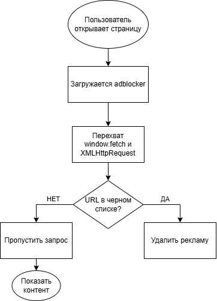

# Техническое руководство: создание блокировщика рекламы (AdBlocker) с нуля на JavaScript

![Схема работы AdBlocker] ()

## Цель руководства
Научиться создавать простой, но работающий блокировщик рекламы, который перехватывает сетевые запросы к рекламным доменам и отменяет их. Руководство рассчитано на начинающих веб-разработчиков.

## Аудитория
Студенты, junior-разработчики, интересующиеся внутренним устройством браузера и перехватом глобальных API.

## Что вы узнаете
- Как перехватить `window.fetch` и `XMLHttpRequest`.
- Как составить чёрный список рекламных доменов.
- Как отменить нежелательный запрос.
- Как удалить рекламные элементы со страницы (базово).
- Как протестировать блокировщик на локальной HTML-странице.

---

## Необходимые знания
- Базовый JavaScript (функции, промисы, массивы).
- Понимание DOM и консоли браузера.

---

## Пошаговая инструкция

### Шаг 1. Создаём структуру проекта
Создайте файл с названием `adblocker.js`

### Шаг 2. Пишем чёрный список рекламных доменов
В файле `adblocker.js` определите массив доменов, которые будут блокироваться.

```javascript
const blockedDomains = [
    'doubleclick.net',
    'googleadservices.com',
    'googlesyndication.com',
    'adservice.com',
    'criteo.com'
];

### Шаг 3. Перехватываем window.fetch
Сохраняем оригинальный метод и заменяем его своей функцией.

const originalFetch = window.fetch;
window.fetch = function(url, options) {
    if (blockedDomains.some(domain => url.toString().includes(domain))) {
        console.log(`[AdBlocker] Заблокирован запрос fetch: ${url}`);
        return Promise.reject(new Error('Запрос заблокирован AdBlocker'));
    }
    return originalFetch(url, options);
};

### Шаг 4. Перехватываем XMLHttpRequest

const originalOpen = XMLHttpRequest.prototype.open;
XMLHttpRequest.prototype.open = function(method, url) {
    if (blockedDomains.some(domain => url.includes(domain))) {
        console.log(`[AdBlocker] Заблокирован XHR: ${url}`);
        this.abort();
        return;
    }
    return originalOpen.apply(this, arguments);
};

### Шаг 5. Тестирование
Открываем любой сайт с кучей рекламы
Нажмите F12 → вкладка Console и вставить код программы.
Вы должны увидеть сообщения о блокировке, iframe не загрузится.